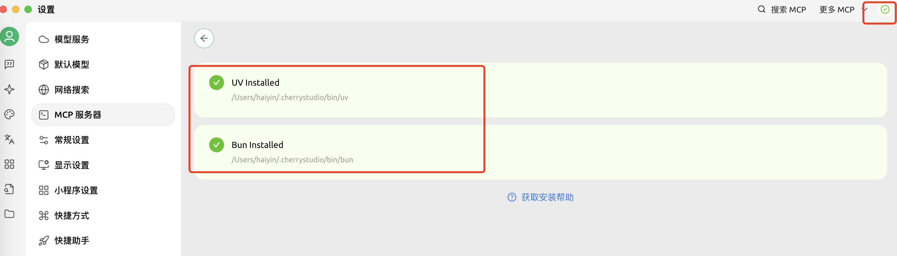
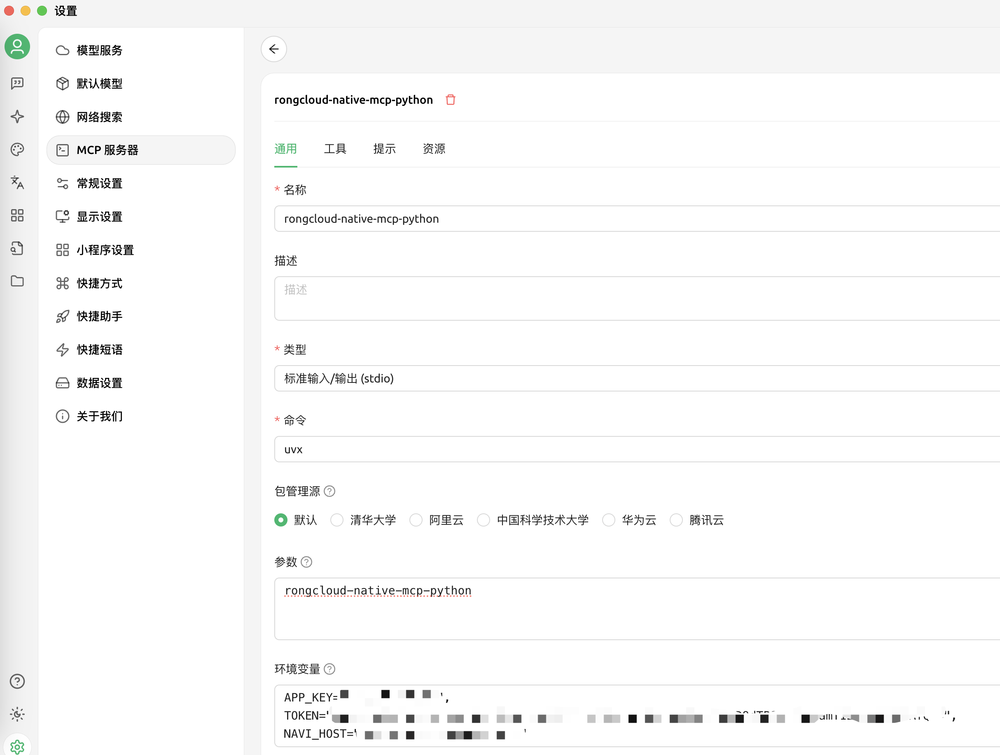

# Rongcloud Native MCP

基于 MCP 协议的融云 IM 服务（包装 Rust SDK）

[English Documentation](README_EN.md)

## 使用方法

### 前提--安装 UV 包管理工具

```bash
 pip install uv 
```

UV 是一个用 Rust 编写的 Python 包安装和依赖管理工具，比传统工具（如 pip）有着更快、更高效的体验。它主要关注两个核心目标：

速度: UV 在包安装、依赖解析和虚拟环境创建等方面进行了优化，速度有显著的提升。
效率: UV 可以减少资源消耗，尤其是在大型项目中。

后续我们会用到 UVX 命令，它的作用是"如果本地没有，先下载。再运行"，而且每次都是在单独的虚拟环境中，很适合大模型/Agent相关场景

### 在 Cursor 中使用（Cline / Claude 类似）

配置路径：Cursor -> 首选项 -> Cursor Settings -> MCP -> Add new global MCP server
配置内容：

```json
{
  "mcpServers": {
    "rongcloud-native-mcp-python": {
      "name": "rongcloud-native-mcp-python",
      "type": "stdio",
      "command": "uvx",
      "args": [
        "rongcloud-native-mcp-python"
      ],
      "env": {
          "APP_KEY": "融云 App Key",
          "TOKEN": "应用 SDK Token (从 Server API 获取)",
          "AREA_CODE": "数据中心区域码（北京 = 1，新加坡 = 2，北美 = 3，新加坡B = 4，沙特 = 5），非公有云客户不设置",
          "NAVI_URL": "导航地址（非公有云客户）",
          "STATS_URL": "数据统计地址（非公有云客户）"
      }
    }
  }
}

```

### 环境变量说明

- `APP_KEY`: （必填）您的融云应用密钥
- `TOKEN`: （必填）应用 SDK 令牌，从服务器 API 获取
- `AREA_CODE`: （可选）数据中心区域代码：
  - 1: 北京
  - 2: 新加坡
  - 3: 北美
  - 4: 新加坡 B
  - 5: 沙特
  - 注意：非公有云客户请勿设置
- `NAVI_URL`: （可选）导航 URL，非公有云客户必填
- `STATS_URL`: （可选）统计 URL，非公有云客户必填

### 在 Cherry studio 中使用

先安装 UV 和 Bun（都需要安装），安装后重启 Cherry Studio。然后按照下图配置：



## 主要功能与工具（tools）说明（持续更新）

服务端通过 MCP 协议暴露以下工具：

### 1. `send_private_text_message`

- **功能**：发送 IM 消息给指定用户（私聊）
- **参数**：
  - `user_id` (str, 默认"")：消息接收者的用户ID
  - `content` (str, 默认"")：消息内容
  - `ext_content` (dict, 默认{})：扩展内容字典，用于附加消息数据
- **返回**：
  - 失败：包含 `code` 和 `error` 的字典
  - 成功：包含 `code`、`message_id` 和 `message` 的字典

### 2. `send_group_text_message`

- **功能**：发送 IM 消息给指定群组（群聊）
- **参数**：
  - `group_id` (str, 默认"")：群组ID
  - `content` (str, 默认"")：消息内容
  - `ext_content` (dict, 默认{})：扩展内容字典，用于附加消息数据
- **返回**：
  - 失败：包含 `code` 和 `error` 的字典
  - 成功：包含 `code`、`message_id` 和 `message` 的字典

### 3. `get_private_messages`

- **功能**：获取与指定用户的历史消息（私聊）
- **参数**：
  - `user_id` (str, 默认"")：用户ID
  - `order_asc` (bool, 默认False)：是否按升序排列，默认为降序
  - `count` (int, 默认10)：获取的消息数量
- **返回**：
  - 失败：包含 `code` 和 `error` 的字典
  - 成功：包含 `code` 和消息数组的字典

### 4. `get_group_messages`

- **功能**：获取指定群组的历史消息（群聊）
- **参数**：
  - `group_id` (str, 默认"")：群组ID
  - `order_asc` (bool, 默认False)：是否按升序排列，默认为降序
  - `count` (int, 默认10)：获取的消息数量
- **返回**：
  - 失败：包含 `code` 和 `error` 的字典
  - 成功：包含 `code` 和消息数组的字典

### 5. `send_private_image_message`

- **功能**：发送图片消息给指定用户（私聊）
- **参数**：
  - `user_id` (str, 默认"")：消息接收者的用户ID
  - `thumbnail_base64` (str, 默认"")：缩略图的base64编码
  - `image_uri` (str, 默认"")：图片URI地址
  - `ext_content` (dict, 默认{})：扩展内容字典，用于附加消息数据
- **返回**：
  - 失败：包含 `code` 和 `error` 的字典
  - 成功：包含 `code`、`message_id` 和 `message` 的字典

### 6. `send_group_image_message`

- **功能**：发送图片消息给指定群组（群聊）
- **参数**：
  - `group_id` (str, 默认"")：群组ID
  - `thumbnail_base64` (str, 默认"")：图片缩略图的base64编码
  - `image_uri` (str, 默认"")：图片URI地址
  - `ext_content` (dict, 默认{})：扩展内容字典，用于附加消息数据
- **返回**：
  - 失败：包含 `code` 和 `error` 的字典
  - 成功：包含 `code`、`message_id` 和 `message` 的字典

### 7. `recall_message`

- **功能**：撤回指定消息
- **参数**：
  - `message_dict` (dict)：完整的消息对象，包含message_id、conversation_type、target_id等字段
- **返回**：
  - 失败：包含 `code` 和 `error` 的字典
  - 成功：包含 `code` 和 `message` 的字典

**注意**：
- IM 引擎会在首次调用任何消息相关工具时自动初始化和连接
- 服务器断开连接时会自动处理资源清理

## 常见问题

### Q: 为什么配置了 Cursor 但是服务器列表中一直是黄色小圆点？

A: 服务器列表中显示黄色小圆点，尝试先安装 UV 命令，重启 Cursor 后重新开启服务开关。

### Q: 为什么 Cherry Studio 一直报错？

A: 确保 UV 和 Bun 安装成功，重启 Cherry Studio 后重新开启服务开关。

### Q: 为什么调用工具后返回错误？

A: 确保环境变量（APP_KEY、TOKEN、NAVI_URL）正确设置，重启服务后重新调用工具。

## 技术支持

如果遇到问题，请：

1. 检查环境变量是否正确设置
2. 查看日志输出，了解具体错误信息
3. 在开源项目中提issue
